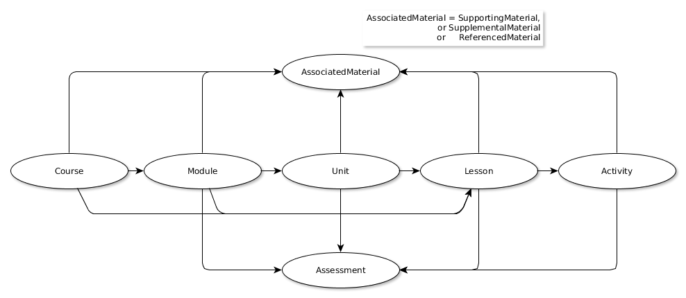

#K12 OCX Content Model
This section presents the conceptual model used by K12 OCX to define what is being transferred and the realization of this model in one more file containing content and metadata.

##The Entities represented
The curriculum, content and materials being exchanged are represented in the K12 OCX Content Model using the using the **[OER Schema](http://oerschema.org/docs/schema.html)** model:

`Course`, `Module`, `Unit`, `Lesson`, `Activity`, `Assessment` and `SupportingMaterial` are all sub classes of [oer:LearningComponent](http://oerschema.org/LearningComponent/).

`SupportingMaterial`, `SupplementalMaterial` and `ReferencedMaterial` are sub classes of  `ocx:AssociatedMaterial` (to do: define this formally)

`LearningComponents` are related to other `LearningComponents` using the `hasPart` property (and the reverse `isPartOf`). `LearningComponents` are related to `AssociatedMaterial` using the `ocx:material` property (an extension of [oer:material](http://oerschema.org/material/))

__Note__: This model is based on [schema.org](https://schema.org), and hence on RDF and uses the W3C [architecture of the World Wide Web](https://www.w3.org/TR/webarch/).

Below we make a quick alignment of different OER providers with this default OER Schema suggestion.

|       | Course | Module | Unit | Lesson | Activity | Supporting Material | Assessment |
|-------|--------|--------|------|--------|----------|---------------------|------------|
|**UnboundEd**| Grade | Module | Unit / Topic | Lesson | Activity | Materials / Downloads | Assessment (it's a Unit) |
|**IM**| Grade/Course | Unit | Section | Lesson | Activity | Materials (teacher, family, course guide) | Unit-level Assessments |
|**Open Up**| Grade | Unit | ? (maybe Section?) | Lesson | Activity | Materials (teacher, family, course guide) | ? |
|**EngageNy**| Curriculum | Module / Strand | Unit / Topic / Domain | Lesson / Document | ? | Material / Download | ? |

##Identifiers
As we use an RDF-based model to describe the CCM being exchanged, any content that is to be described must be identifiable with a URI, preferably a resolvable http:// URI. Since a Course/Module/Unit/etc is not a web page, the URI that is used to identify such content must be distinct from that used for the web page through which it is represented.

__Note__: A useful pattern adopted in this documentation is the use of fragment identifiers based on the web page URL to identify entities represented on that page. So, if the web page `http://example.org/MyLesson` represents an OER Schema Lesson, the URI used to identify that lesson might be of the form `http://example.org/MyLesson#lesson` or similar.

##Content Files and Formats
The content being transferred may be contained in a single digital document or many. As this content will be presented through web pages or ebooks, the format of the digital document must be HTML5 or translatable to HTML5.

If the content is contained in more than one digital document, then a [manifest](manifest/index.md) must be provided in order to provide information about the location of all the documents and the logical and pedagogic structure of the content. Individual documents contain [in-page](inpage/index.md) structural and descriptive metadata about the resources they represent.
