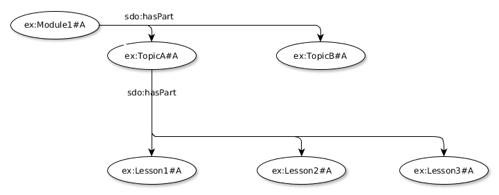
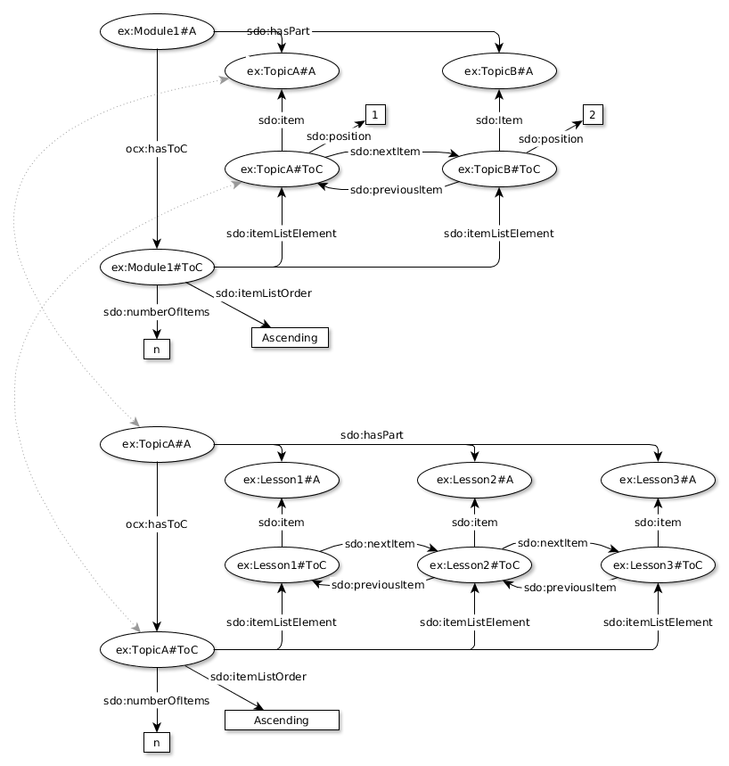

# Structuring Aggregations
We provide information about logical and pedagogically appropriate sequences for displaying or presenting  the components of complex curriculum materials using schema.org with some additional terms from OER Schema.

There are currently two proposals for how to sequence the content. One approach is a simple JSON-LD ordered list. The other approach is founded on encoding the structure using schema.org ItemLists, which can be interpreted as a table of contents.

We recommend this information is provided as linked data encoded in JSON-LD (or potentially RDFa).

__Editor's note__ : for more information about the thinking behind this approach see [Structure and sequence of book- or course-like resources](https://docs.google.com/document/d/1CDIcyoYtg9WeWpno_wyuNRJmqyn80_hVKjpKBjIG7GE/edit#heading=h.e3fwche8pgr6).


## An Unordered Aggregation
We represent the whole-part relationships of complex curriculum materials using schema.org and OER Schema.

Schema.org org allows us to say that a CreativeWork (such as a Book) has parts (Chapters). The terminology of Books and Chapters may be too restrictive for curriculum materials in general, and so we recommend the use of OER Schema's type vocabulary.

### Recommended Vocabulary Identifiers

| Vocabulary | Namespace : Context URI |
| ---------- | ----------------------- |
| schema.org | `sdo : http://schema.org/`   |
| OERSchema  | `oer : http://oerschema.org/` |

### Recommended Classes / Types

| Type              | Definition  |
| ----------------- | ----------- |
| `sdo:CreativeWork`| The most generic kind of creative work, including books, movies, photographs, software programs, etc.|
| `sdo:Book`        | A book. |
| `sdo:Chapter`     | One of the sections into which a book is divided. A chapter usually has a section number or a name. |
| `sdo:WebPage`     | A web page. |
| `sdo:WebSite`     | A website. |
| `sdo:Course`      | A sequence of one or more educational events and/or creative works which aims to build knowledge, competence or ability of learners. |
| `oer:Module`      | A module [the largest possible subpart]|
| `oer:Unit`        | A unit [part of a module, comprising several lessons]|
| `oer:Lesson`      | A lesson [a smaller component than a Unit] |
| `oer:Activity`    | An activity performed by students which can be assessed and graded. |
| `oer:Assessment`  | An assessment of a student's activity. |
| `oer:SupportingMaterial`| Material that teaches the learning objectives of the course. |

Further information about mapping the OERSchema classes to the terms used by specific providers is given in the section on [semantic markup](../metadata/markup/)

###  Recommended Properties

Properties of sdo:CreativeWork

| Property      | Expected Type | Definition                         |
| ------------- | ------------- | ------------------------------------------ |
| `sdo:hasPart` | sdo:CreativeWork | Indicates an item or CreativeWork that is part of this item, or CreativeWork (in some sense) |

__Note:__ All the schema.org types are subtypes of sdo:CreativeWork and so may be used wherever sdo:CreativeWork is the expected type. The leniency of domain and range specification in schema.org allows us to treat the OER Schema types as if they were CreativeWorks.

### Example
A module comprises two topics, one of the topics comprises three lessons

```
{
  "@context": {
    "ex": "http://example.org/" ,
    "sdo": "http://schema.org/" ,
    "oer": "http://oerschema.org/",
    "sdo:hasPart" : {
      "@type" : "@id"
    }
  },
  "@graph": [
    {
      "@id": "ex:Module1#A",
      "@type": ["sdo:CreativeWork", "oer:Module"],
      "sdo:hasPart": ["ex:TopicA#A", "ex:TopicB#A" ]
    },
    {
      "@id": "ex:TopicA#A",
      "@type": ["sdo:CreativeWork", "oer:Unit"],
      "sdo:hasPart": [
        "ex:Lesson1#A",
        "ex:Lesson2#A",
        "ex:Lesson3#A"
      ]
    },
    {
      "@id": "ex:TopicB#A",
      "@type": ["sdo:CreativeWork", "oer:Unit"]
    },
    {
      "@id": "ex:Lesson1#A",
      "@type": ["sdo:CreativeWork", "oer:Lesson"]
    },
    {
      "@id": "ex:Lesson2#A",
      "@type": ["sdo:CreativeWork", "oer:Lesson"]
    },
    {
      "@id": "ex:Lesson3#A",
      "@type": ["sdo:CreativeWork", "oer:Lesson"]
    }
  ]
}
```
__Editor's Note:__ hacking the context for sdo:hasPart to be stricter than schema.org's own and to generate links not values.

__Editor's Note:__ do folk prefer their JSON-LD examples as separate linked objects, as above, or as nested objects?

__Notes:__

The identifiers should be different to the URLs of specific instances of these resources. They identify relationships that are true for any instance of these resources, and as such they identify an abstract resource of which specific instances are manifestations. Appending `#A` to the URL of the official or authoritative web page for the resource is a useful pattern for generating a different URI but still using a URI that will provide human users with a meaningful link.

Further information about the resources could be provided here, such as the URL to locate the content (`sdo:url`) and the name (`sdo:name`) of the resource, however this would duplicate information in the sitemap used to [locate](../manifest/locate) the resources, and embedded markup used to [describe](../metadata/markup) the resources.

## An Ordered Aggregation
__Editor's Note OPEN ISSUE__: there are two options for ordering the component resources in an aggregation. Option 1 is a JSON array (i.e. an ordered list) of identifiers specifying a default order. This mirrors the approach taken for W3C Web Publications (ePub for the web). Option 2 is inspired by OAI-ORE and leverages schema.org ItemLists. Option 2 is conceptually and practically far more complex, however it may be more robust, and may more useful for providing information about next & previous components within the files for each component. It remains an open issue as to whether the extra complexity is manageable or necessary.

## An Ordered Aggregation - Option 1
We provide information about the default logical and pedagogically appropriate sequence for displaying or presenting the components of complex curriculum materials using a JSON array of URIs, each URI representing a component. This approach is based on the [default reading order](https://www.w3.org/TR/wpub/#default-reading-order) of the (draft) W3C [Web Publications](https://www.w3.org/TR/wpub/) spec.

### Recommended Vocabulary Identifiers
| Vocabulary | Namespace : Context URI |
| ---------- | ----------------------- |
| OCX extensions | `ocx` |

__Editor's note:__ do we need to get context URI for OCX?

### Recommended Properties
| Property      | Expected Type  | Defintion |
| ------------- | -------------- | --------- |
| `ocx:defaultOrder` | a list of URIs | The default order in which to present the resources in the aggregation to the user.  |

__Note:__ The ordering may be changed for many reasons, for example, remixing the content or adaptive delivery.

__Note:__ JSON-LD arrays are unordered by default (in contrast with regular JSON). Ordering can be enforced using the `@list` JSON-LD keyword.

__Note:__ In JSON-LD lists of lists are not allowed. Therefor the ordering for each level of a hierarchical aggregation must be specified separately.

### Example
A module comprising a sequence of two topics, the first of which is a sequence of three lessons.

```
{
  "@context": {
    "ex": "http://example.org/" ,
    "sdo": "http://schema.org/" ,
    "oer": "http://oerschema.org/",
    "sdo:hasPart" : {
      "@type" : "@id"
    }
  },
  "@graph": [
    {
      "@id": "ex:Module1#A",
      "@type": ["sdo:CreativeWork", "oer:Module"],
      "sdo:hasPart": ["ex:TopicA#A", "ex:TopicB#A" ],
      "ocx:defaultOrder": {"@list": ["ex:TopicA#A", "ex:TopicB#A"]}
    },
    {
      "@id": "ex:TopicA#A",
      "@type": ["sdo:CreativeWork", "oer:Unit"],
      "sdo:hasPart": [
        "ex:Lesson1#A",
        "ex:Lesson2#A",
        "ex:Lesson3#A"
      ],
      "ocx:defaultOrder": {
        "@list": ["ex:Lesson1#A", "ex:Lesson2#A", "ex:Lesson3#A"]
      }
    },
    {
      "@id": "ex:TopicB#A",
      "@type": ["sdo:CreativeWork", "oer:Unit"]
    },
    {
      "@id": "ex:Lesson1#A",
      "@type": ["sdo:CreativeWork", "oer:Lesson"]
    },
    {
      "@id": "ex:Lesson2#A",
      "@type": ["sdo:CreativeWork", "oer:Lesson"]
    },
    {
      "@id": "ex:Lesson3#A",
      "@type": ["sdo:CreativeWork", "oer:Lesson"]
    }
  ]
}
```

## An Ordered Aggregation - Option 2
We provide information about logical and pedagogically appropriate sequences for displaying or presenting  the components of complex curriculum materials using schema.org ItemLists.

Ordering several levels of a hierarchy requires that we nest ItemLists, i.e. we have lists of lists.

We have to be careful because reuse and repurposing of resources means that the same resources may appear in different orders when used by different people, however previous work [[OAI-ORE](https://www.openarchives.org/ore/)] shows a solution to this. In order avoid this issue we create resources that are "proxies" for the components and sequence these. These proxies can be thought of as entries in a table of contents structure and are the ListItems in the schema.org ItemList.

### Recommended Vocabulary Identifiers
In addition to the vocabularies used for an unordered aggregation we need

| Vocabulary | Namespace : Context URI |
| ---------- | ----------------------- |
| OCX extensions | `ocx` |

__Editor's note:__ do we need to get context URI for OCX?

### Recommended Classes / Types
In addition to the types used for an unordered aggregation we need

| Type           | Definition  |
| -------------- | ----------- |
| `sdo:ItemList` |  A list of items of any sort |
| `sdo:ListItem` |  An item in a list |

### Recommended Properties
Properties of a sdo:CreativeWork.

| Property      | Expected Type  | Defintion |
| ------------- | -------------- | --------- |
| `ocx:hasToC`  | `sdo:ItemList` | The aggregate resource has a table of contents that specifies a possible logical or pedagogically appropriate ordering of its parts. |

Properties of a sdo:ItemList.

| Property              | Expected Type | Defintion |
| --------------------- | ------------- | --------- |
| `sdo:itemListElement` | `sdo:ListItem` or `sdo:ItemList`  | A resource in this list [i.e., an entry in the table of contents]. |
| `sdo:itemListOrder`   | Text          | The type of ordering. Permitted values are Ascending, Descending, Unordered. |
| `sdo:numberOfItems`   | Integer       | The number of items in the ItemList |

__Note:__ the order of elements in the mark-up is not sufficient for indicating the order of items in the list.  Use ListItem with a 'position' property in such cases.

Properties of a sdo:ListItem

| Property           | Expected Type      | Defintion |
| ------------------ | ------------------ | --------- |
| `sdo:item`         | `sdo:CreativeWork` | The component being represented by this entry in the list |
| `sdo:nextItem`     | `sdo:ListItem`     | A link to the ListItem that follows the current one |
| `sdo:position`     | Integer            | The position of an item in a series or sequence of items |
| `sdo:perviousItem` | `sdo:ListItem`     | A link to the ListItem that preceeds the current one  |

__Editor's Note:__ The terminology of ListItem and ItemList; nextItem (which is a ListItem), item (which is not a ListItem) and itemListElement (which is a ListItem, and sometimes also an ItemList) is confusing, but it's what schema.org has given us `¯\_(ツ)_/¯`.

### Example

A module comprising a sequence of two topics, the first of which is a sequence of three lessons.



```
{
  "@context": {
    "ex": "http://example.org/" ,
    "sdo": "http://schema.org/" ,
    "oer": "http://oerschema.org/" ,
    "ocx:hasToC": {
      "@type" : "@id"
    },
    "sdo:item": {
      "@type" : "@id"
    },
    "sdo:nextItem": {
      "@type" : "@id"
    },
    "sdo:previousItem": {
      "@type" : "@id"
    },
    "sdo:hasPart": {
      "@type" : "@id"
    }
  },
  "@graph": [
    {
      "@id": "ex:Module1#A",
      "@type": ["sdo:CreativeWork", "oer:Module"],
      "sdo:hasPart": ["ex:TopicA#A", "ex:TopicB#A" ],
      "ocx:hasToC": "ex:Module#ToC"
    },
    {
      "@id": "ex:TopicA#A",
      "@type": ["sdo:CreativeWork", "oer:Unit"],
      "sdo:hasPart": [
        "ex:Lesson1#A",
        "ex:Lesson2#A",
        "ex:Lesson3#A"
      ],
      "ocx:hasToC": "ex:TopicA#ToC"
    },
    {
      "@id": "ex:TopicB#A",
      "@type": ["sdo:CreativeWork", "oer:Unit"]
    },
    {
      "@id": "ex:Lesson1#A",
      "@type": ["sdo:CreativeWork", "oer:Lesson"],
      "ocx:hasToC": "ex:Lesson1#ToC"
    },
    {
      "@id": "ex:Lesson2#A",
      "@type": ["sdo:CreativeWork", "oer:Lesson"],
      "ocx:hasToC": "ex:Lesson2#ToC"
    },
    {
      "@id": "ex:Lesson3#A",
      "@type": ["sdo:CreativeWork", "oer:Lesson"],
      "ocx:hasToC": "ex:Lesson3#ToC"
    },
    {
      "@id": "ex:Module1#Toc",
      "@type": "sdo:ItemList",
      "sdo:itemListOrder": "Ascending",
      "sdo:numberOfItems": 2,
      "sdo:itemListElement": [
        {
          "@id": "ex:TopicA#ToC",
          "@type": ["sdo:ListItem", "sdo:ItemList"],
          "sdo:item": "ex:TopicA#A",
          "sdo:position": 1,
          "sdo:nextItem": "ex:TopicB#ToC",
          "sdo:numberOfItems": 3,
          "sdo:itemListElement" : [
            {
              "@id": "ex:Lesson1#ToC",
              "@type": "sdo:ListItem",
              "sdo:position": 1,
              "sdo:item": "ex:Lesson1#A",
              "sdo:nextItem": "ex:Lesson2#ToC"
            },
            {
              "@id": "ex:Lesson2#ToC",
              "@type": "sdo:ListItem",
              "sdo:position": 2,
              "sdo:previousItem": "ex:Lesson1#ToC",
              "sdo:item": "ex:Lesson2#A",
              "sdo:nextItem": "ex:Lesson3#ToC"
            },
            {
              "@id": "ex:Lesson3#ToC",
              "@type": "sdo:ListItem",
              "sdo:position": 3,
              "sdo:previousItem": "ex:Lesson2#ToC",
              "sdo:item": "ex:Lesson3#A"
            }
          ]
        },
        {
          "@id": "ex:TopicB#ToC",
          "@type": "sdo:ListItem",
          "sdo:item": "ex:TopicB#A",
          "sdo:previousItem": "ex:TopicA#ToC",
          "sdo:position": 2
        }
      ]
    }
  ]
}
```
__Editor's Note:__ Experimenting with ToC as nested objects.

__Editor's Note:__ Hacking the context for sdo: properties to be stricter than schema.org's own and to generate links not values.
